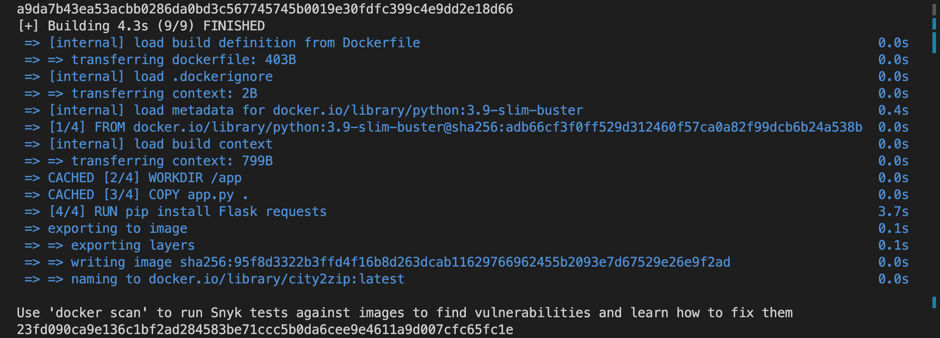
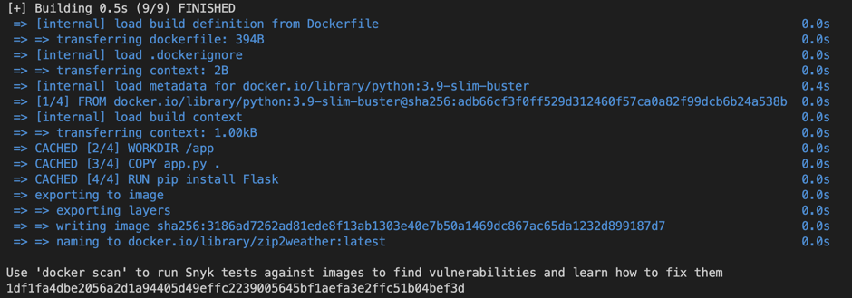
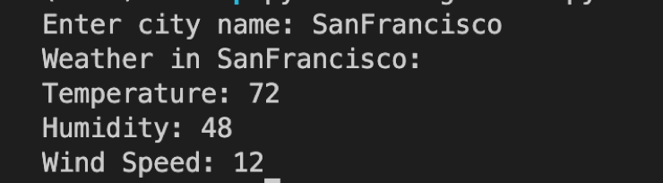

# Microservices Example

This repository contains two microservices and a client script to demonstrate how to build and call microservices using Flask, Docker, and Python.

## Microservices

The two microservices are defined in `app.py`:

- A `city_to_zip` microservice that takes a city name as input and returns the corresponding zipcode.
- A `zip_to_weather` microservice that takes a zipcode as input and returns the corresponding weather information.


## Running the Microservices

To run the microservices, you need to have Docker installed. Then, follow these steps:

1. create docker network
2. Build the Docker image using the Dockerfile:
3. Run the Docker image.

you can run the following commands:

```bash
bash create_network_container.sh
```

## Running the Client

To run the client, you need to have Python 3 and the `requests` library installed. Then, run the following command:


## Running the Integration


    python3 get_weather.py

## Output

The process of creating the docker network and the docker containers:



the results of calling the get_weather.py:

